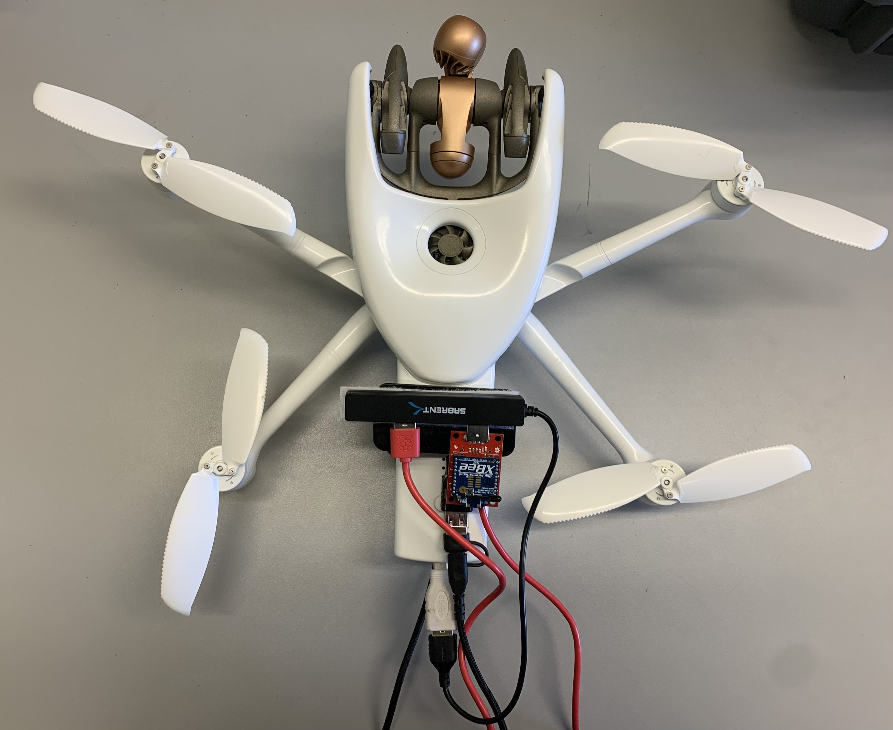

# telemetry_thermal_versions
## Introduction
This project outlines the work accomplished with an industry-grade Parrot [ANAFI Ai drone](https://www.parrot.com/us/drones/anafi-ai). It specifically integrates a custom-designed thermal module with a XBee module on to the ANAFI Ai drone. The designed Air SDK missions utilize the github [airsdk sample](https://github.com/Parrot-Developers/airsdk-samples) "telemetry_py" mission as a base.

The modification does three things: 

#1 writes a file to /mnt/user-internal/missions-data/com.parrot.missions.samples.telemetry_py/telemetry_service.txt and appends the text telemetry_py example mission service. This is used for debugging to make sure the mission/service is still running.

#2 Using a [Raspberry Pi Zero 2 W](https://www.raspberrypi.com/products/raspberry-pi-zero-2-w/) connected to the ANAFI Ai Wi-Fi, an SSH client is established, and commands are executed through this channel to capture and save a thermal image on the drone.

#3 Utilizing the drone's various sensors, the system saves data—including Time, Altitude, Drone Roll, Drone Pitch, Drone Yaw, Gimbal Roll, Gimbal Pitch, Gimbal Yaw, GPS Latitude, GPS Longitude, GPS Altitude, and GPS Satellites—to a .csv file in the drone's local directory and transmits this data via the XBee module.  

To note, there are two versions of this mission because version 1 featured a slightly different hardware architecture, in which the XBee module was connected to the Raspberry Pi via a USB hub as seen in figure 1. In contrast, version 2 has the USB hub connected directly to the drone, along with the XBee module and Raspberry Pi as seen in figure 2. This modification was made to allow the XBee module direct access to the drone, eliminating the unnecessary intermediation of the Raspberry Pi.

Figure 3 depicts the network diagram of the project. In this setup, the Raspberry Pi is commanded via SSH to capture and save a thermal image onto the drone. Simultaneously, the drone directly commands the XBee module to transmit telemetry data to another XBee module attached to the computer.
<!--  -->

<figure>
    
    <figcaption>Figure 1: Old Setup</figcaption>
</figure>

<figure>
    
    <figcaption>Figure 2: New Setup</figcaption>
</figure>

<figure>
    
    <figcaption>Figure 3: Network Diagram</figcaption>
</figure>

## Setup
### Hardware Components
- Parrot ANAFI Ai
- 1 Raspberry Pi Zero 2 W with case
- 1 TOPDON TC001 Thermal Camera
- 1 XBee module
- 1 USB hub
- Adapters: 1 USB hub, 1 micro USB to USB-A, 1 USB-C to USB-A, 1 micro USB cable
- Air SDK 7.7
- Ubuntu OS computer 20.04 LTS
- Velcro
### Raspberry Pi Zero 2 W
After installing the operating system onto the micro SD card using the Raspberry Pi Imager, copy the `thermal_snapshot_V2.py` file to the Raspberry Pi Desktop. Then, connect the Raspberry Pi to the drone's Wi-Fi and record the IP address of the Raspberry Pi by excuting `ifconfig`. Then type the recorded Raspberry Pi IP address into the 'server' variable within the `/services/example_telemetry/main.py` file (Raspberry Pi IP address is automatically kept static). Finally, connect the thermal camera to the Raspberry Pi.

### Mission installation
[Air SDK 7.7](https://developer.parrot.com/docs/airsdk/index.html)

Cd into the directory where the mission.yaml is located and connect to the drone's Wi-Fi

To build and install the mission/service to the drone execute
```bash
airsdk build && airsdk install --default
```
Side note: If the mission/service is already installed on the drone and you want to test a new feature that has been added, it is considered best practice to first uninstall the existing mission from the drone before installing the new version of the mission/service.
```bash
airsdk build && airsdk uninstall com.parrot.missions.samples.telemetry_py && airsdk install --default
```
To list the missions that are currently installed on the drone execute
```bash
airsdk list
``` 
## Observing the mission operate
Connect to the drone's Wi-Fi and open a shell to the drone by executing. Note, you might have to run the command multiple times to connect successfully.
```bash
adb connect anafi-ai.local:9050 && adb shell
```
Navigate to the mission directory to view the names of the thermal images being transferred
```bash
cd /mnt/user-internal/missions-data/com.parrot.missions.samples.telemetry_py/
```
To verify that the mission is active, execute the following command to observe an increase in the number of lines within the telemetry_service.txt file
```bash
while true; do cat telemetry_service.txt | wc -l; sleep 5; done
```
If the number of lines in the telemetry_service.txt file increases, then the mission is running successfully. Executing a 'ls' command should reveal new thermally imaged files, timestamped and located in the same directory.

At this point, one should observe data being transmitted to their computer attached XBee module, time-stamped thermal images, and the telemetry_data.csv file in the drone's mission directory. Please note that the files receiveDataSample.py and thermal_snapshot_V2.py are provided here as references. The first demonstrates how to receive data from the XBee module, while the second is executed on the Raspberry Pi to capture the thermal image.

## Copyright ©

This program is free software: you can redistribute it and/or modify it under the terms of the GNU General Public License as published by the Free Software Foundation, either version 3 of the License, or (at your option) any later version.

This program is distributed in the hope that it will be useful, but WITHOUT ANY WARRANTY; without even the implied warranty of MERCHANTABILITY or FITNESS FOR A PARTICULAR PURPOSE. See the GNU General Public License for more details.

GNU General Public License:  <https://www.gnu.org/licenses/>. 

Loyola Marymount Univeristy, hereby disclaims all copyright interest in the program “telemetry_thermal_versions” written by Justin Hynes.

signature of Justin Hynes 28 April 2024
Justin Hynes, Computer Engineer masters research assistant 

